# ピカピカ学園

Peewee ORM を使用した Flask Web アプリケーション

## 概要

小学生を対象とした教育クイズアプリです

クイズにチャレンジして、チケットをゲット！
チケットがたまったら、ワクワクするゲームに挑戦できます
ゲームでコインをたくさん集めて、ランキング 1 位を目指そう 🏆✨

ゲーミフィケーションを用いてルーレットやランキングによるモチベーション向上を図り、楽しみながら学習できるよう設計されています。


## スクリーンショット

トップ
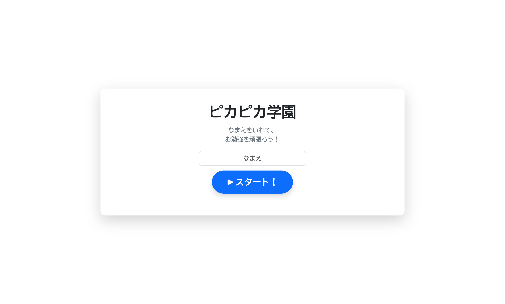

選択画面
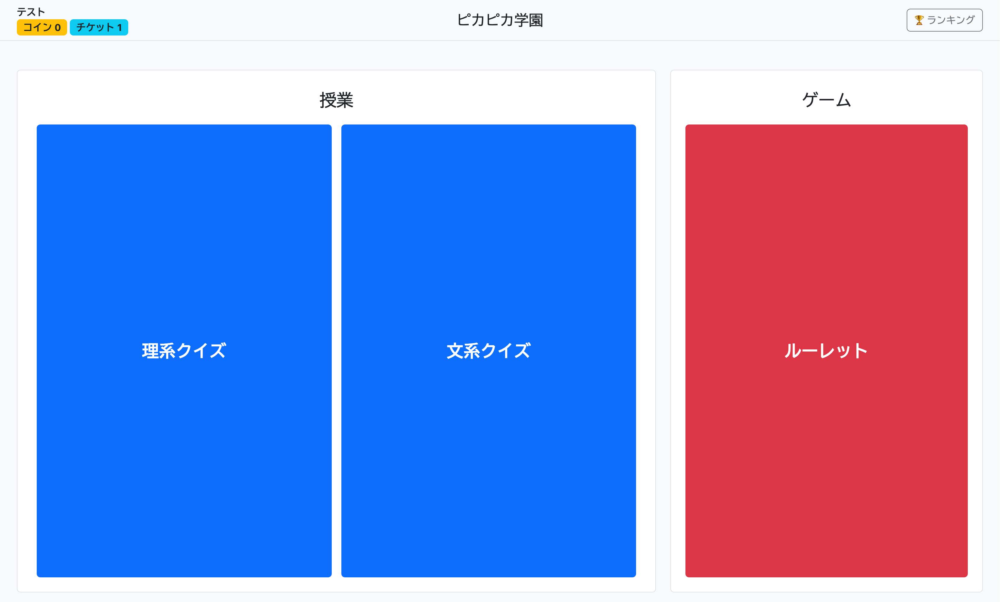

授業1 - レベル選択
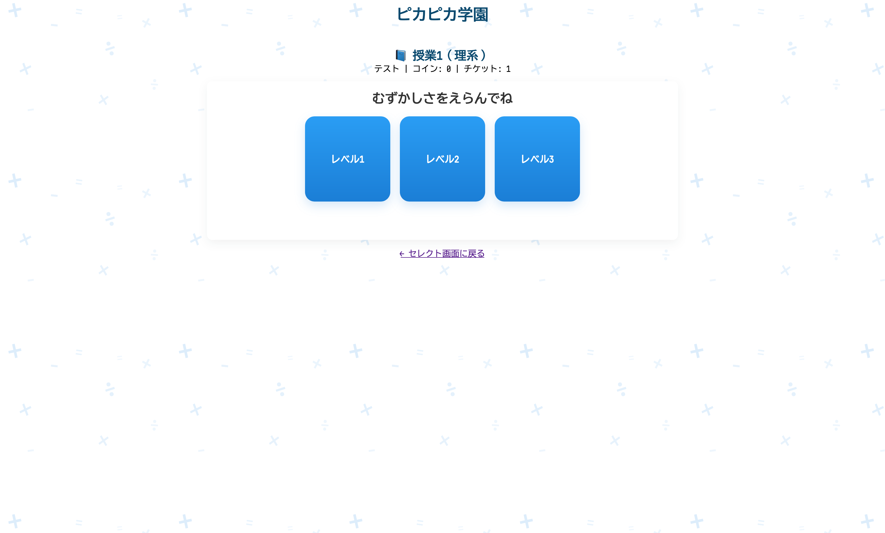

授業1 - 問題画面
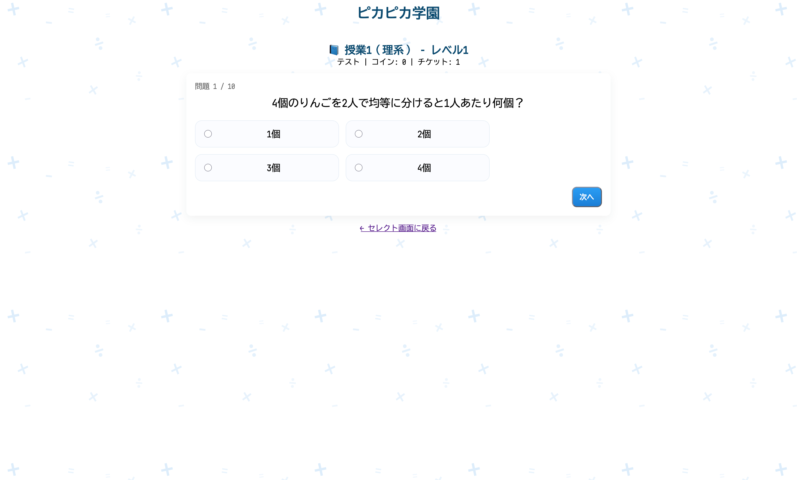

授業1 - 結果画面
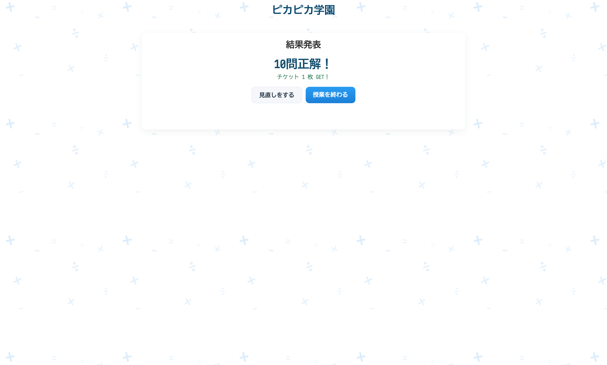


授業1 - 結果画面（見直し）
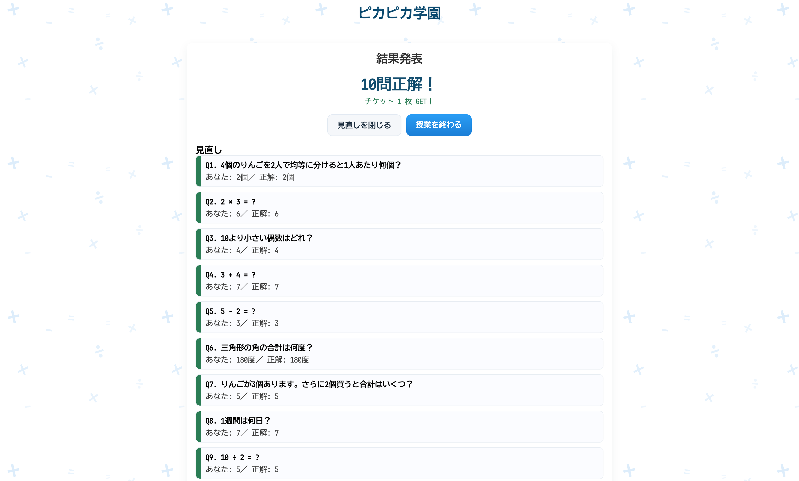

授業1 - 結果画面 （不合格）
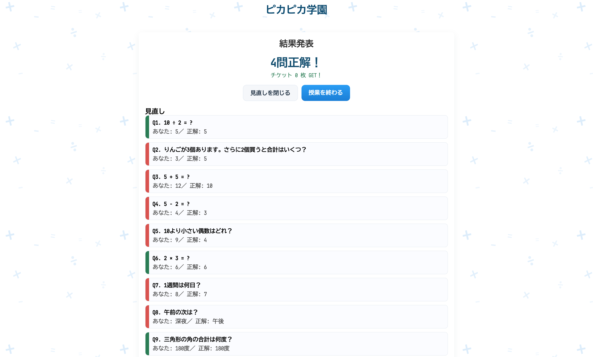

授業2 - レベル選択
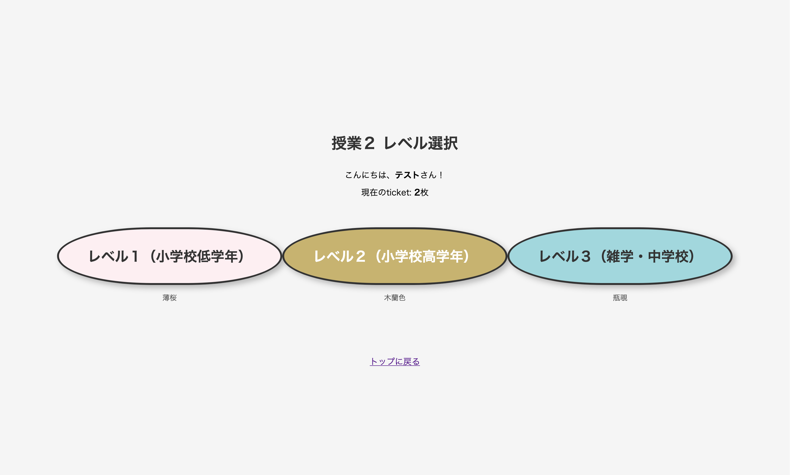

授業2 - 問題画面
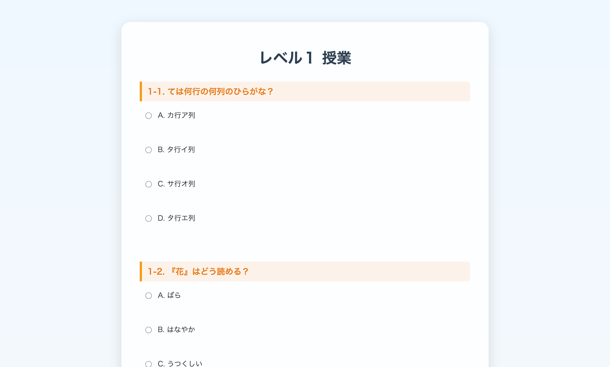

授業2 - 結果画面
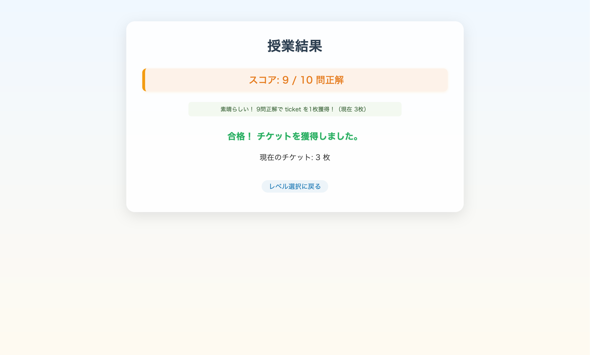

授業2 - 結果画面（不合格）
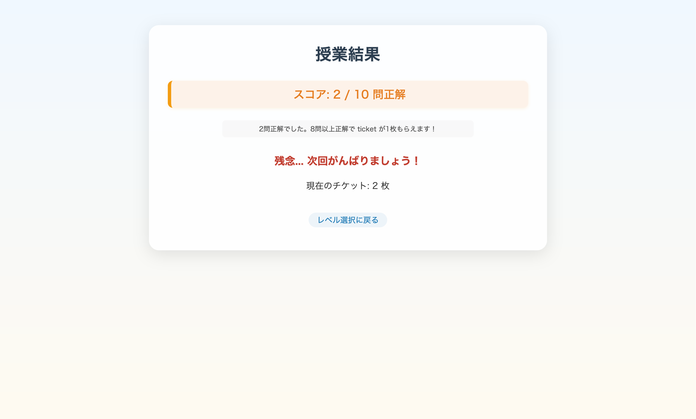

ゲーム画面
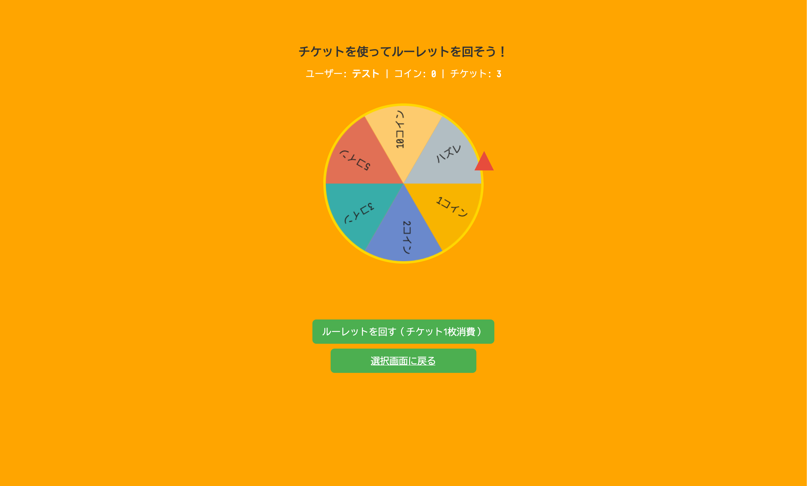

ゲーム結果画面
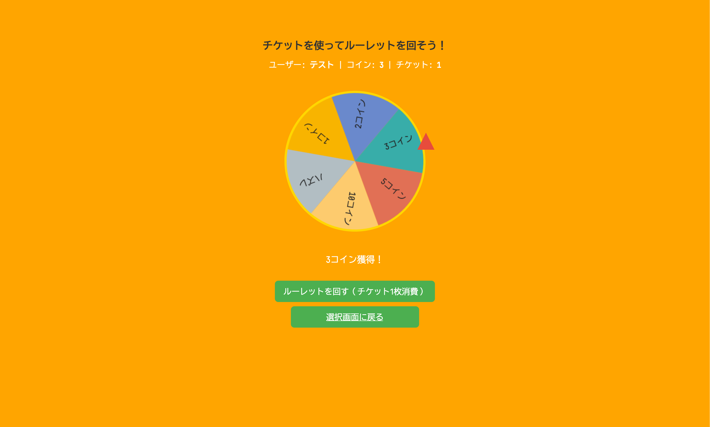

ランキング画面
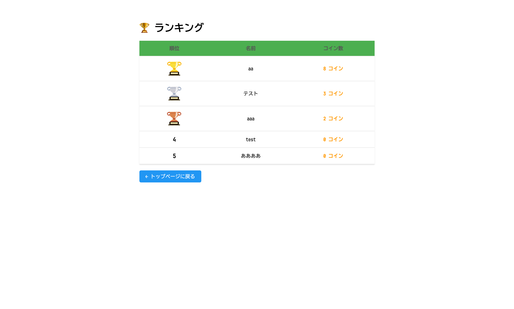


## セットアップ

### 実行要件

このアプリケーションを実行するには、以下の環境が必要です：

- **Python**: 3.8 以上（推奨: 3.11 以上）
- **OS**: macOS / Linux / Windows
- **必須パッケージ**:
  - Flask 3.1.0
  - peewee 3.17.6

### インストール手順

```bash
# 1. リポジトリのクローン（またはダウンロード）
cd pikapika-school

# 2. 依存パッケージのインストール
pip install -r requirements.txt
```

### 起動方法

```bash
# アプリケーションの起動
python app.py
```

起動後、ブラウザで以下の URL にアクセス:

- http://localhost:5001


## 使い方

1. アプリケーションを起動します
2. 名前を入力
3. 「▶︎ スタート」ボタンを押すと、選択画面に移動します
4. 選択画面には２つの授業とゲームから何をするか選ぶことができます

### 授業1 - 理系クイズ
授業1は、3つのレベル（レベル1：簡単、レベル2：普通、レベル3：難しい）の算数・科学クイズです。

**流れ：**

1. レベル選択画面で難易度を選ぶ（大きな正方形ボタン）
2. 選んだレベルから 10 問がランダムに出題される
3. 各問題に回答し「次へ」ボタンで進む（進捗バーで現在の位置を表示）
4. 全問完了後、合格判定（80 点以上で合格）
5. 合格時にチケットを獲得（レベル 1:1 枚、レベル 2:2 枚、レベル 3:3 枚）
6. 見直しボタンで不正解問題を確認できる
7. 授業を終わるボタンで授業選択画面に戻る

**出題内容：**

- レベル 1：足し算・引き算、単位換算（cm ↔ m）、基本的な図形問題
- レベル 2：掛け算・割り算、分数、素数判定、関数基礎
- レベル 3：化学（元素記号、化学式）、方程式、ピタゴラスの定理、密度計算

### 授業2 - 文系クイズ
授業2は、１と同様に３つのレベル（レベル１：小学校低学年、レベル２：小学校高学年、レベル３：中学生・雑学）を選択して解く国語・社会・道徳・英語のクイズです。

**流れ**
1. レベル選択画面で、和色に彩られたボタンでレベルを選択してください。色はそれぞれ、レベル１が薄桜・レベル２が木蘭色・レベル３が瓶覗となっています。
2. クイズがランダムに10問出題されます。
3. 回答を選んだら、一番下にあります『解答する』ボタンを押下してください。
4. ８問以上正解で、合格となりチケットが付与されます（チケット枚数については、レベル１が１枚、レベル２が２枚、レベル３は４枚となっています）。
5. それぞれの戻るボタンで、一つ前のページに戻ることができます。ただし、授業結果ページでは、レベル選択画面に戻ります。

- レベル１：ひらがな、かたかな、アルファベット、小学校１〜３年生までの漢字、基本的な防犯や防災意識の形成、地域社会への理解
- レベル２：ことざわ、四字熟語、基本的な英語、小学校４〜６年生までの漢字、日本についての基礎知識、日本の歴史
- レベル３：長文問題、中学生以上の難しい問題

#### ゲームを選択した場合

1. ルーレットが画面に表示される
2. 授業で得たチケットを 1 枚消費することによってルーレットが回る
3. 止まったマスに応じたコインを獲得できる
4. 選択画面に戻る


## 主要ファイルの役割詳細

## 主要なファイル構成と解説

```
pikapika-school/
├── app.py                    # アプリケーションのエントリーポイント
│                             # Flaskアプリの初期化、Blueprintの登録
│
├── models/                   # データモデル層
│   ├── db.py                # Peewee データベース接続設定（SQLite使用）
│   └── user.py              # Userモデル（name, coin, ticket, created_atフィールド）
│
├── routes/                   # ルーティング層（各機能ごとにBlueprint分割）
│   ├── main.py              # メインページ、選択画面、ランキング
│   ├── class1.py            # 授業1（理系クイズ）の全ロジック
│   ├── class2.py            # 授業2（文系クイズ）の全ロジック
│   └── game.py              # ゲーム（ルーレット）のロジック、チケット消費・コイン付与
│
├── templates/                # HTMLテンプレート（Jinja2）
│   ├── index.html           # トップページ（名前入力）
│   ├── select.html          # 授業・ゲーム選択画面
│   ├── class1.html          # 授業1のレベル選択画面
│   ├── class1_level.html    # 授業1の問題表示画面
│   ├── class1_result.html   # 授業1の結果表示・見直し画面
│   ├── class2.html          # 授業2のレベル選択画面
│   ├── level_result.html    # 授業2の結果表示・見直し画面
│   ├── game.html            # ルーレットゲーム画面
│   └── ranking.html         # ランキング表示画面
│
├── static/                   # 静的ファイル（CSS）
│   ├── style.css            # 共通スタイル
│   └── class1_style.css     # 授業1専用スタイル（算数シンボル背景等）
│
└── pikapika.db              # SQLiteデータベース（初回起動時に自動作成）
```

#### `app.py`

- Flask アプリケーションの初期化
- SECRET_KEY の設定（セッション管理用）
- データベーステーブルの作成
- 各 Blueprint（main_bp, class1_bp, game_bp）の登録
- 開発サーバーの起動（ポート 5001）

#### `models/user.py`

- ユーザー情報のデータモデル
- フィールド: name（名前）、coin（コイン数）、ticket（チケット数）、created_at（作成日時）

#### `routes/main.py`

- `/`: トップページ（名前入力・ユーザー登録）
- `/select`: 授業・ゲーム選択画面
- `/ranking`: コインランキング表示

#### `routes/class1.py`

- `/class1`: レベル選択画面
- `/class1/level<int>`: クイズ開始（問題のランダム抽出）
- `/class1/level<int>/q/<int>`: 各問題の表示・回答処理
- `/class1/level<int>/result`: 結果表示・チケット付与
- cookie 認証でユーザーを識別（`_get_user_and_cookie()`ヘルパー関数）

#### `routes/game.py`

- `/game`: ルーレットゲーム画面
- `/game/spin`: ルーレット実行（POST）、チケット消費・コイン付与
- cookie 認証でユーザーを識別

## アピールポイント

### ① 小学生でもわかりやすい画面遷移
 本アプリは、小学生が直感的に操作できることを重視して設計しています。  
 画面構成はシンプルにまとめ、ボタン数や表示情報を最小限にすることで、操作に迷うことなく次の行動が一目で分かるよう工夫しました。  
 また、画面遷移の流れも「クイズを解く → チケット獲得 → ゲームに挑戦」という明確な構造にすることで、初めて利用する小学生でも安心して利用できます。

### ② 勉強意欲が湧くアプリ設定
 クイズに正解することでチケットを獲得し、そのチケットを使ってゲームを遊べる仕組みを採用しています。  
 このように「勉強」と「遊び」を自然につなげることで、クイズに取り組むこと自体が楽しくなり、自発的に学習を続けられるよう工夫しました。  
 さらに、ゲーム内で獲得できるコインやランキング機能を用意することで、目標を持って継続的に学習できる環境を実現しています。

### ③ 授業 1 での UI/UX と技術的な工夫

**UI/UX の工夫：**
- 小学生向けシンプル設計：大きなボタン、中央寄せレイアウト、ボタン数最小化
- 問題を大きく表示、選択肢を幅広く配置して操作ミスを減らす
- 結果画面で「大きく正解数を表示」し、達成感を演出
- 見直しボタンで正解／不正解を色分け表示（緑：正解、赤：不正解）

**技術的な工夫：**

- ブラウザ cookie（`ppk_user`）でユーザーを識別・永続化
  - 初回アクセス時に自動的にユーザーを作成し、cookie に ID を記録
  - 以降のアクセスで cookie から同じユーザーを復元
  - セッション管理で安全なアクセス制御
- サーバサイドでの進捗率計算でテンプレート内の計算式を削除（パフォーマンス向上）
- Jinja2 ループで enumerate の代わりに `loop.index0` を使用（テンプレート互換性向上）
- class1 専用スタイル(`static/class1_style.css`)で全体デザインを統一
- 算数シンボル（+、−、×、÷、=）を背景に配置した教育的な見た目

### ④　授業２での簡単に問題を追加できる仕組みと、文系特有の長文問題の仕組み
**問題の追加**
- お子様が問題を自作できるような仕組み
  - .htmlを用意されている問題を参考に作成してください。このとき、**必ず10題**で作成してください。
  - CSSを別途に用意した為、level#_#.htmlは見やすくなっています｡
  - 作成していただいた.html（ファイルの名前は自由で大丈夫です）をtemplatesフォルダへ保存してください。
  - class2.pyに、答えを入力してください。レベルは３つ用意されています｡
  - 問題のファイルはランダムに選択されて、出題されます。

**文系特有の長文問題に対応**
- 文系には国語での古典・読解問題や英語の長文問題、道徳での条件を細かく記入する問題などが存在します。このような、問題にもしっかり対応できる仕様となっています。
  - レベル３では、長文問題なども出題していただけます。
  - 200文字より長い問題を検知すると、自動でCSS（ページの見え方）を長文用に切り替えます。
  - 普通の短い問題も問題なく出題いただけます。

 ### ⑤ ゲームでの工夫
 ゲーム画面では、クイズに正解することで獲得したチケットを消費することで、ルーレットを回すことができます。
 ルーレットは画面内で回転して、止まったマスに応じてもらえるコインが変わります。
 シンプルなゲーム操作で小学生でもわかりやすく遊べるようになっています。
 小学生でも理解しやすいように、ルーレットのアニメーションを実装し、視覚的に楽しめる工夫をしています。
 
## トラブルシューティング

### 1. `Address already in use` または `OSError: [Errno 48] Address already in use`

**原因**: ポート 5001 が既に別のプログラムで使用されている

**対処法**:

```bash
# ポート5001を使用しているプロセスを確認
lsof -i:5001

# 該当プロセスを終了（PIDを確認してから）
kill -9 <PID>
```

#### 2. `peewee.DoesNotExist: User instance matching query does not exist`

**原因**: 存在しないユーザー ID でアクセスしようとしている

**対処法**:

- ブラウザの cookie をクリア
- データベースを削除して再作成:

```bash
rm pikapika.db
python app.py  # 再起動で自動的にテーブルが再作成される
```
